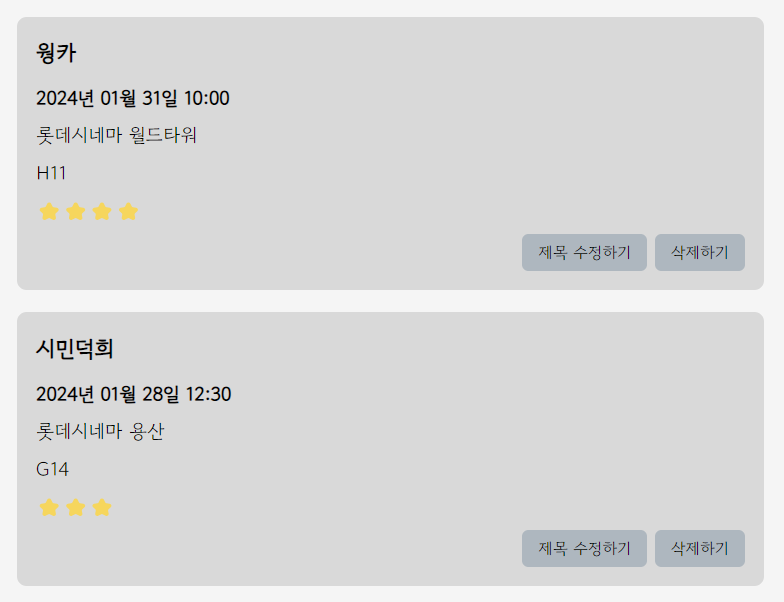
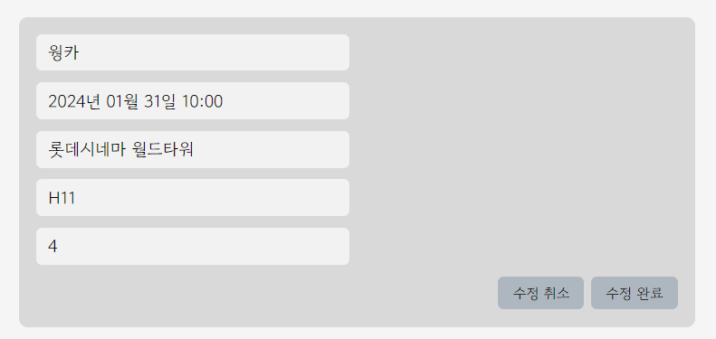

### 🎬 간단한 영화 기록 다이어리
한입 크기로 잘라 먹는 리액트 강의 일기장 실습 응용한 미니 프로젝트 

---

<br />

### 1일차
- <strong>관람 영화 정보</strong>를 작성하는 컴포넌트 구성


<br/>

- <strong>작성한 관람 정보</strong>들을 렌더링하는 컴포넌트 구성


<br/>
<br/>

#### ✔️ 구현한 것
- 영화 제목, 관람 정보, 별점 평가 입력 처리
- 저장하기 버튼 클릭 시 입력 조건 확인 및 alert로 알려주기
- App.js에 임의로 생성한 영화 데이터 리스트 렌더링하기

<br/>
<br/>

#### ⭐ 추가해야할 것
- <span style="text-decoration:line-through">저장하기 버튼 클릭했을 때 조건에 맞지 않으면 포커스 이동시키기 (제목)</span>
- <span style="text-decoration:line-through">임의로 생성한 데이터가 아닌, 사용자가 입력한 데이터 렌더링하기</span>
- <span style="text-decoration:line-through">MovieList 컴포넌트에서 리스트 렌더링할 때 각 리스트 아이템들을 MovieItem 컴포넌트로 분리하기</span>
- 이미지 첨부 기능 및 렌더링 기능 추가하기
<br/>
<br/>

#### 🌠 트러블 슈팅
🚨 새로운 컴포넌트 파일을 추가하였는데 `Module not found: Can't resolve` '라이브러리명'.. 에러가 발생하면서 렌더링되지 않는 문제 발생
➡️ `node_modules` 폴더, `package-lock.json` 파일 삭제 후 `npm install`로 재설치하여 해결
<br/>

🚨 저장하기 버튼을 클릭했을 때 사용자가 입력한 문자열의 길이를 조건처리하여 alert 창을 띄우고 싶은데, 사용자가 입력하는 값과 버튼 컴포넌트가 분리되어 있어 MovieTitle의 상태를 상위 컴포넌트인 MovieWrite으로 전달하고, MovieWrite에서 받은 상태를 SubmitBtn으로 전달해야했음 
```js
function MovieWrite() {
  const [movieTitle, setMovieTitle] = useState("");
  const giveTitle = (title) => {
    setMovieTitle(title);
  }

  return (
    <div className='movieWrite'>
      <MovieTitle giveTitle={giveTitle} />
      <SubmitBtn movieTitle={movieTitle} />
    </div>
  )
}
```
➡️ 상위 컴포넌트인 MovieWrite에서 상태를 하나 더 만들고, 함수를 만들어서 하위 컴포넌트로 해당 함수를 전달한다. 
```js
import React, { useState } from 'react'

function MovieTitle({giveTitle}) {
  const [title, setTitle] = useState("");
  const onChange = (e) => {
    setTitle(e.target.value);
    giveTitle(e.target.value);
  }
  return (
    <div className='movieTitle'>
      <input 
        value={title}
        onChange={onChange}
      />
    </div>
  )
}
```
➡️ 상위 컴포넌트에서 하위 컴포넌트로 전달한 상위 컴포넌트의 상태를 변화시키는 함수를 props로 받아서 해당 함수를 활용해 상위 컴포넌트의 상태를 변경시키는 방식으로 구현함.

</br>
</br>
</br>

---
### 2일차
- <strong>사용자가 입력한</strong> 영화 기록 데이터 <strong>저장</strong> 기능 추가 (리스트 렌더링) 
-> 임의로 생성했던 데이터를 렌더링하는 방식에서 사용자가 입력한 데이터를 렌더링하도록 변경함



<br/>

- <strong>저장한 영화 기록 삭제, 수정 기능 추가</strong>



<br/>
<br/>
<br/>

#### ✔️ 구현한 것
- (수정) 분리한 컴포넌트 합치기
  ▪️ 작성하는 컴포넌트에서 제목 입력 컴포넌트, 상세 관람 정보 입력 컴포넌트, 저장하기 버튼 컴포넌트를 모두 분리했었는데 상태를 전달하는 과정이 복잡하고 코드가 깔끔하지 않아 분리한 컴포넌트를 다시 합침. 
- 영화 제목 입력 조건을 만족하지 않은 상태에서 저장하기 버튼을 클릭하면 제목 입력창으로 포커스 이동시키기
- 사용자가 입력 후 저장한 영화 기록 데이터 리스트 렌더링
- 저장한 영화 기록 데이터의 제목 및 관람정보 수정 및 삭제 기능 추가

<br/>
<br/>

#### ⭐ 추가해야할 것
- MovieItem 컴포넌트 스타일링 수정
- 이미지 첨부 기능 및 렌더링 기능 추가하기
- 영화 기록, 책 기록 분리시키기
<br/>
<br/>

#### 🌠 트러블 슈팅
🚨 관람 정보를 작성하고 저장하기 버튼을 눌렀을 때 다른 입력창은 모두 빈 문자열로 초기화 되는데, 별점은 사용자가 저장한 별점이 별 한 개로 초기화되지 않는 문제 발생
➡️ `MovieEditor` 컴포넌트에서 select 태그에 state.star로 value값을 주지 않아서 초기화되지 않았던 것! value 값 지정으로 해결했다.
